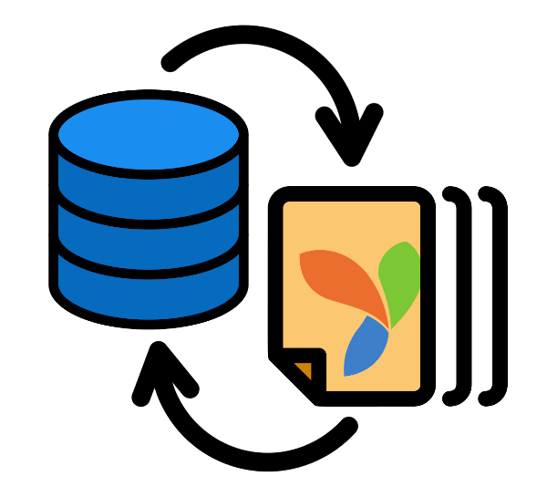

# Yii 2 Migration


[](https://packagist.org/packages/bizley/migration)


## Migration Creator And Updater

Generates migration file based on the existing database table and previous migrations.

## Installation

Run console command

```
composer require bizley/migration
```

Or add the package to your `composer.json` file:

```json
{
    "require": {
        "bizley/migration": "^4.0"
    }
}
```

then run `composer update`. 

## Configuration

Add the following in your configuration file (preferably console configuration file):

```php
[
    'controllerMap' => [
        'migration' => [
            'class' => 'bizley\migration\controllers\MigrationController',
        ],
    ],
]
```

## Usage

The following console command are available (assuming you named the controller `migration` like in the example above):

- List all the tables in the database:

  ```
  php yii migration
  ```
    
  or

  ```
  php yii migration/list
  ```

- Generate migration to create DB table `table_name`:

  ```
  php yii migration/create table_name
  ```

- Generate migration to update DB table `table_name`:

  ```
  php yii migration/update table_name
  ```

To generate migrations for all the tables in the database at once (except the excluded ones) use asterisk (*):

```
php yii migration/create *
php yii migration/update *
```

You can generate multiple migrations for many tables at once by separating the names with comma:

```
php yii migration/create table_name1,table_name2,table_name3
```

You can provide an asterisk as a part of table name to use all tables matching the pattern:

```
php yii migration/update prefix_*
```

Creating multiple table migrations at once forces the proper migration order based on the presence of the foreign keys. 
When tables are cross-referenced the additional foreign keys migration is generated at the end of default generation.

## Updating migration

You can easily generate updating migration for database table by comparing its current schema with the migration history.

1. History of applied migrations is scanned to gather all modifications made to the table.
2. Virtual table schema is prepared and compared with current table schema.
3. Differences are generated as update migration.
4. In case of migration history not keeping information about the table creating migration is generated.

## Command line parameters

| command              | alias | description                                                             
|----------------------|:-----:|------------------------------------------------------------------------------------
| `migrationPath`      | `mp`  | Directory (one or more) storing the migration classes.
| `migrationNamespace` | `mn`  | Namespace (one or more) in case of generating namespaced migration.
| `useTablePrefix`     | `tp`  | Whether the table names generated should consider the `tablePrefix` setting of the DB connection.
| `migrationTable`     | `mt`  | Name of the table for keeping applied migration information.
| `onlyShow`           | `os`  | Whether to only display changes instead of generating update migration.
| `generalSchema`      | `gs`  | Whether to use general column schema instead of database specific (see [1] below).
| `fixHistory`         | `fh`  | Whether to add migration history entry when migration is generated.
| `skipMigrations`     |       | List of migrations from the history table that should be skipped during the update process (see [2] below).
| `excludeTables`      |       | List of tables that should be skipped.


[1] Remember that with different database types general column schemas may be generated with different length.

> ### MySQL examples:  
> Column `varchar(255)`  
> generalSchema=false: `$this->string(255)`    
> generalSchema=true: `$this->string()`  

> Column `int(11) NOT NULL AUTO_INCREMENT PRIMARY KEY`    
> generalSchema=false: `$this->integer(11)->notNull()->append('AUTO_INCREMENT PRIMARY KEY')`  
> generalSchema=true: `$this->primaryKey()`

> When column size is different from DBMS' default it's kept:  
> Column `varchar(45)`  
> generalSchema=false: `$this->string(45)`    
> generalSchema=true: `$this->string(45)`

[2] Here you can place migrations containing actions that cannot be covered by the extractor i.e. when there is a migration 
setting the RBAC hierarchy with authManager component. Such actions should be kept in separated migration and placed on 
this list to prevent them from being run during the extraction process.

## Renaming

When you rename a table or a column remember to generate appropriate migration manually otherwise this extension will 
not generate updating migration (in case of the table) or will generate migration with command to drop the original column 
and add renamed one (in case of the column). This is happening because yii2-migration can only compare two states of 
the table without the knowledge of how one state turned into another. While the very result of migration renaming 
the column and the one dropping it and adding another is the same in terms of structure, the latter **makes you lose data**.

Once you add renaming migration to the history it's being tracked by the extension.

## Migrating from v2 or v3 to v4

See [Migrating to version 4.0](migrating_to_v4.md) section.

## Notes

This extension should work with all database types supported in Yii 2 core:

- CUBRID (9.3.x and higher)
- MS SQL Server (2008 and above)
- MySQL (4.1.x and 5.x)
- Oracle
- PostgreSQL (9.x and above)
- SQLite (2/3)

Only history of migrations extending `yii\db\Migration` class can be properly scanned and only changes applied with
default `yii\db\Migration` methods can be recognised (except for `execute()`, `addCommentOnTable()`, and 
`dropCommentFromTable()` methods). Changes made to table's data (like `insert()`, `upsert()`, `delete()`, `truncate()`, 
etc.) are not tracked.

Updating migrations process requires for methods `createTable()`, `addColumn()`, and `alterColumn()` to provide changes 
in columns definition in form of an instance of `yii\db\ColumnSchemaBuilder` (like `$this->string()` instead of `'varchar(255)'`).

## Tests

Tests for MySQL, PostgreSQL, and SQLite are provided. Database configuration is stored in `tests/config.php` (you can 
override it by creating `config.local.php` file there).  
Docker Compose file for setting up the databases is stored in `tests/docker`.

## Previous versions

These versions are not developed anymore but still available for all poor souls that are stuck with EOL PHP.
Some of the newest features may not be available there.

| version constraint | PHP requirements | Yii requirements                                                             
|:------------------:|:----------------:|:----------------:
| ^3.6               | >= 7.1           | >= 2.0.15.1
| ^2.9               | < 7.1            | 2.0.13 to track non-unique indexes, 2.0.14 to handle `TINYINT` and `JSON` type columns.
